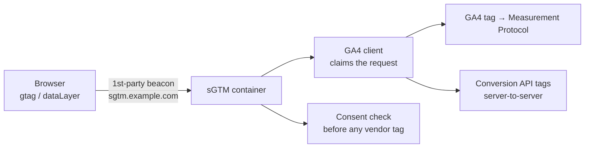

# Server-Side GTM

Move tag execution off the browser and into a server you control. This is the standard form of
an in-house, pre-sGTM server-side collection system, built before Google shipped
server-side GTM (sGTM).

## Why server-side

- **First-party context.** The browser talks only to your own tagging domain
  (`sgtm.example.com`), set as a same-site subdomain. Cookies are written first-party, so they
  survive ITP/cookie limits far better than third-party ones.
- **Control over what leaves.** You decide, server-side, which fields each vendor receives.
  No more "every pixel sees everything." Easier to keep RGPD data-minimization honest.
- **Durability & performance.** One lightweight client beacon instead of a dozen vendor
  scripts; enrichment and fan-out happen server-side.

## Flow

1. The page sends **one** request to your first-party tagging domain.
2. The **GA4 client** parses it into an event the container understands.
3. Server-side **tags** forward to GA4 (Measurement Protocol) and to ad platforms via their
   server-to-server Conversion APIs — each receiving only the fields it needs.
4. Every vendor tag is **gated on the consent state** carried in the event.

## Files

- [`ga4-forwarding-tag.md`](./ga4-forwarding-tag.md) — a sandboxed server-tag template snippet
  that forwards a consented event to GA4 and stamps a first-party Impression ID (feeds the
  [cookieless attribution](../cookieless-attribution) module).

## Setup outline

1. Map a subdomain (`sgtm.example.com`) to the container — same site as the main domain.
2. Add the **GA4 client** to claim incoming requests.
3. Server GA4 tag → your Measurement ID; forward only consented events.
4. Add Conversion API tags per platform; pass hashed identifiers only when `ad_user_data` is granted.
5. Log a first-party `impression_id` server-side for cookieless attribution downstream.
